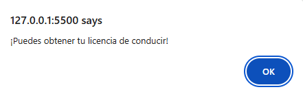

# <h1 align="center"> Desafíos del curso Lógica de programación: sumérgete en la progración con JavaScript </h1>

<p style="text-align: center"></p>

## Descripción del proyecto

```sh

Este es un curso introductorio a la lógica de programación utilizando JavaScript como lenguaje de 
programación. El objetivo principal es que los estudiantes aprendan los conceptos y fundamentos 
básicos de la lógica de programación, como variables, estructuras de control, funciones, entre otros.

A lo largo del curso, los estudiantes desarrollarán un proyecto práctico llamado "Número Secreto", 
en el cual aplicarán estos conceptos de programación. De esta manera, podrán entender cómo llevar 
ideas del mundo real al mundo de la programación.

```

## Recursos y herramientas utilizados

```sh

- Discord: para comunicarse con los compañeros y aclarar dudas.
- Curso y formación de Alura Latam: para consultar contenidos relevantes y obtener más información.
- GitHub: para publicar y compartir el código del proyecto.

```

## Tecnologías Utilizadas

- HTML para ejecutar el archivo de javascript (*.js)

- JavaScript

## Resultados del Desafío 1

>> 

>> 

>> 

>> 

>> 

>> 

## Resultados del Desafío 2

>> 

>> 

>> 

>> 

>> 

>> 

>> 

## Resultados del Desafío 3

>> 

>> 

>> 

>> 

## Resultados del Desafío 4

>> 

>> 

>> 

>> 

>> 

## Autores del Proyecto

>>     Programación JavaScript

## Certificado

>> 
